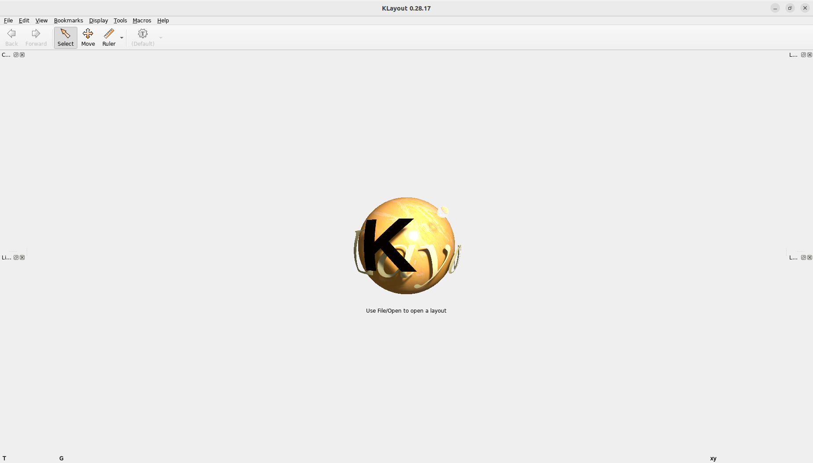

## Введение

### Установка ПО

1. Выполните установку [OpenLane](https://github.com/The-OpenROAD-Project/OpenLane) на свой компьютер, пользуясь инструкцией из репозитория проекта.

2. Скачайте репозиторий практической работы на свой компьютер и перенесите папку vlsi_be_labs в паку, в которой установлен OpenLane.

### Знакомство с проектом

3. Перейдите в папку vlsi_be_labs. Рассмотрим её структуру:
    - lefs - директория, содержащая технологический LEF файл skywater.lef, а также вспомогательный файл sky130_fd_sc_hd.lef с LEF файлом для каждого из библиотечных элементов;
    - lib - директория, содержащая единый LIB файл для всех ячеек:  sky130_fd_sc_hd_tt_025C_1v80.lib;
    - scr - директория, содержащая скрипты. Имеет поддиректории:
        - syn -  директория, содержащая единый скрипт для логического синтеза syn.tcl;
        - layout - дирекория, содержащая скрипты, необходимые для разработки топологии;
        - sdc - директория, содержащая файл временных ограничений const.sdc, который будет использоваться на этапе разработки топологии;
        - gds - директория, содержащая скрипты необходимые для генерации финального GDS файла с помощью САПР Magic;
    - skywater-pdk - директория, содержащая файл lef2gds.map, позволяющий сопоставить названия слоев из Tech LEF файла с номерами слоёв в GDS файле, поддиректорию cells с характеризующими файлами для каждой ячейки и поддиректорию libs.tech со вспомогательными файлами для генерации GDS;
    - verilog - директория, содержащая RTL модель проекта в формате verilog;
    - work - рабочая директория, содержащая соответствующие пустые поддиректории для выполнения каждого этапа работы. В эти поддиректории будут также выписываться результаты выполнения работы.

### Знакомство с RTL моделью

4. Перейдите в директорию verilog и откройте файл seven_segment_seconds.v

    Проведите краткий анализ RTL модели блока: обратите внимание на общий размер файла, количество модулей, наличие или отсутствие последовательностной логики. Также оцените общее количество входов и выходов.
    Если вы обладаете достаточным знанием verilog, постарайтесь определить функциональность блока.

### Просмотр LEF и GDS файлов в KLayout

5. Вернитесь в корневую директоию OpenLane. запустите в этой папке терминал. Затем запустите OpenLane, выполнив команду :

```bash
make mount
```

После выполнения этой команды становятся доступны используемые в данной работе САПР в рамках OpenLane. Дальнейшая работа будет выполняться в этом терминале. Если по какой то причине данная сессия оказалась завершена, повторите данный пункт.

6. Перейдите в папку, содержащую файлы, характеризующие ячейку AND с помощью команды:

```bash
cd vlsi_be_labs/skywater-pdk/cells/and2
```

7. Запустите KLayout, выполнив команду:

```bash
klayout
```

В результате откроется графический интерфейс САПР KLayout:



