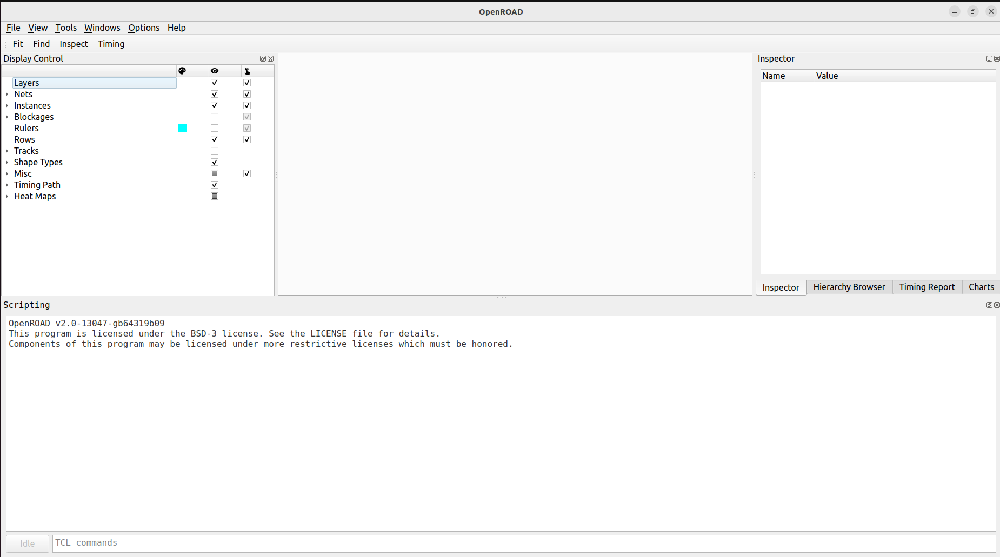
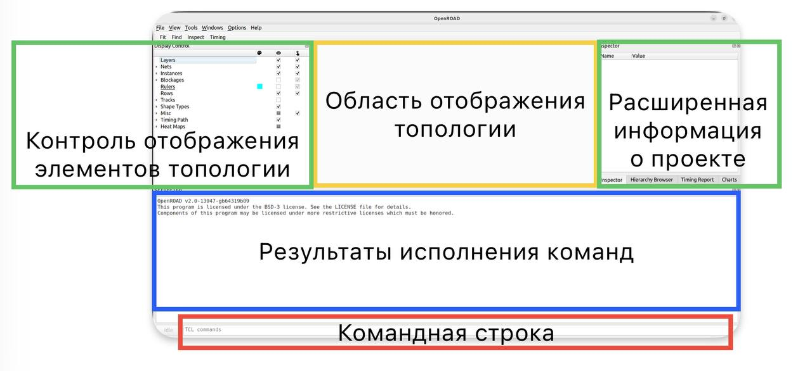

## Разработка топологии

### Запуск OpenROAD

1. В терминале перейдите  в папку work/layout и запустите команду:

```bash
openroad -gui -log log.txt
```

Данная команда запустит САПР OpenRoad в режиме графического интерфейса, а также создаст файл log.txt куда будут записываться результаты выполнения команд.

2. Ознакомимся с интерфейсом OpenRoad:



На рисунке ниже обозначены основные элементы графического интерфейса САПР:




Нижняя часть графического интерфейса, по сути, представляет собой терминал, в котором и будет происходить основная работа над топологией блока

### Загрузка проекта в OpenROAD

3. В командной строке OpenROAD запустите команду:

```tcl
source ../../scr/layout/load_design.tcl
```

Произойдет исполнение скрипта load_design.tcl, имеющего следующее содержание:

```tcl
############################################################################################
#set units and define corner
set_cmd_units -time ns -capacitance pF -current mA -voltage V -resistance kOhm -distance um
define_corners typical
############################################################################################

############################################################################################
#Read LEF files
read_lef ../../lefs/sky130.tlef ; # Techlef

read_lef ../../lefs/sky130_fd_sc_hd.lef ; # load all cell lefs
############################################################################################

############################################################################################
# Read LIB file
read_liberty -corner typical ../../lib/sky130_fd_sc_hd__tt_025C_1v80.lib
############################################################################################

############################################################################################
# Read the netlist
read_verilog ../syn/segment_seconds_netlist.v
link_design seven_segment_seconds
############################################################################################

############################################################################################
# Read SDC file
read_sdc ../../scr/sdc/const.sdc
############################################################################################
```