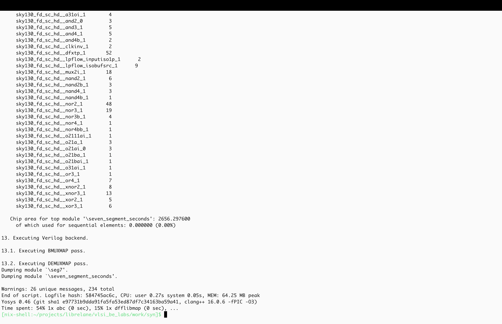
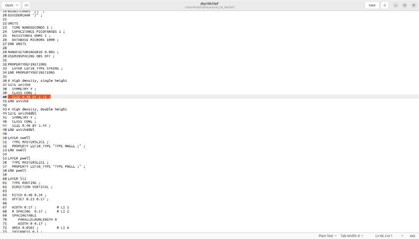

**Синтез в Yosys**

1. Перейдите  папку work/syn с помощью команды (данная команда также создаст нужную папку если она отстутствует):

```bash
mkdir -p work/syn && cd work/syn
```

и запустите команду:

```bash
yosys ../../scr/syn/syn.tcl -l log.txt
```

При запуске этой команды САПР yosys выполнит скрипт syn.tcl и запишет всю информацию о процессе выполнения в файл log.txt.

Скрипт syn.tcl имеет следующее содержание:

```tcl
# usage yosys ../../scr/syn/syn.tcl -l log.txt

# to use tcl correctly
yosys -import

#############################################################
# 1. Reading design
read_verilog ../../verilog/seven_segment_seconds.v
hierarchy -check -top seven_segment_seconds
##############################################################

##############################################################
# 2. Optimization
procs
fsm  
opt
memory 
opt
##############################################################

##############################################################
# 3. Mapping to the library
techmap
opt

dfflibmap -liberty ../../lib/sky130_fd_sc_hd__tt_025C_1v80.lib
abc -liberty ../../lib/sky130_fd_sc_hd__tt_025C_1v80.lib

clean
###############################################################

###############################################################
# 4. Report
stat -liberty ../../lib/sky130_fd_sc_hd__tt_025C_1v80.lib
###############################################################

###############################################################
# 5. Write netlist
write_verilog segment_seconds_netlist.v
###############################################################

```

Скрипт состоит из 5 блоков команд:
-	Загрузка проекта (Reading design) - на этом этапе происходит загрузка RTL модели проекта в формате velilog с помощью команды read_verilog, а также задается top уровень проекта с помощью команды:   hierarchy -check -top <имя top модуля в verilog>;
-	Оптимизация (Optimization) - на этом этапе выполняется набор команд, оптимизирующих логику RTL модели;
-	Трансляция логических функций в базис библиотечных элементов (Mapping to the library) - на этом этапе в командах diffmap и abc используется библиотека стандартных ячеек, элементы которой попадут в итоговый список межсоединений. ABC -  отдельный инструмент, входящий в состав Yosys. Обратите внимание, что на этом этапе необходимо использовать библиотеку стандартных элементов (.lib);
-	Генерация информации о проекте (Report) с помощью команды stat;
-	Выписка списка межсоединений (Write netlist) с помощью команды write_verilog.

После выполнения скрипта в терминале должно быть видно следующее:



В рабочей папке work/syn должны появиться файлы log.txt и segment_second_netlist.v

2. Откройте log.txt и проверьте на наличие ошибок, сделав поиск по ключевому слову **ERROR.** Для вызова поискового окна в текстовом редакторе можно использовать комбинацию клавиш ctrl(command)+f. Убедившись в отсутствии ошибок и наличии в папке синтезированного netlist, перейдем к анализу результатов синтеза.

**Анализ результатов синтеза**

3. Откройте файл segment_second_netlist.v и ознакомьтесь с его содержимым. Обратите внимание, что не смотря на формат .v, netlist отличается от непосредственно описания схемы на языке описания аппаратуры. Главное отличие в том, что в netlist фигурируют библиотечные элементы, что и является основным результатом синтеза - перевод описания на языке описания аппаратуры в базис библиотечных элементов.

4. При логическом синтезе мы не использовали LEF файлы, содержащие большую часть физической информации, однако, используемый при синтезе LIB файл содержит информацию о площади стандартных ячеек, что позволяет САПР вычислить площадь блока по результатам синтеза. Так как на первом этапе разработки топологии необходимо задать размеры проектируемого блока, нам следует обратиться к оценке площади, выполненной в Yosys.

    
    Найдите в выводе информации синтеза (см. рис. 10) раздел:
    “Chip area for top module”.
    И зафиксируйте полученную площадь блока (единица измерения площади  - квадратные микрометры).


5. Так как помимо непосредственно синтезированных ячеек необходимо оставить свободное место для размещения физических ячеек и дополнительных буферов/инверторов, предназначенных для оптимизации, увеличьте полученную площадь в 2 раза тем самым обеспечив заполнение на уровне 50%, которое будет гарантированно предотвращать возможные нарушения при размещении и трассировке.

6. Извлеките квадратный корень из получившейся площади, тем самым получив стороны блока для случая квадратной формы. Такая форма блока является наиболее простой и универсальной.

7. При выборе размера необходимо учесть технологический шаг размещения стандартных ячеек (SITE). Это означает, что размеры блока должны быть кратны данному шагу, который приведен в TechLEF файле. Для удобства необходимый участок файла приведен на рисунке ниже



Размеры блока должны быть кратны размерам SITE unithd, т.е. горизонтальный размер(X) должен быть кратен 0.46, а вертикальный кратен 2.72. 
В задании 6 вы получили одинаковый горизонтальный и вертикальный размеры для блока квадратной формы. Приведите их к кратным 0.46 и 2.72 соответственно значениям, т.е. округлите до ближайших значений кратных 0.46 и 2.72.
Зафиксируйте получившиеся значения для дальнейшего использования.

**Заключение**

На этом мы завершили знакомство с логическим синтезом рассматриваемого цифрового блока. Далее перейдем к работе с топологией.